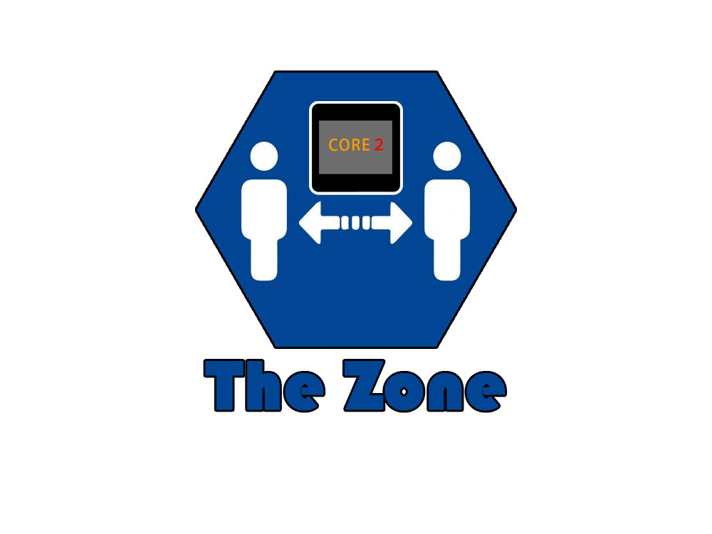
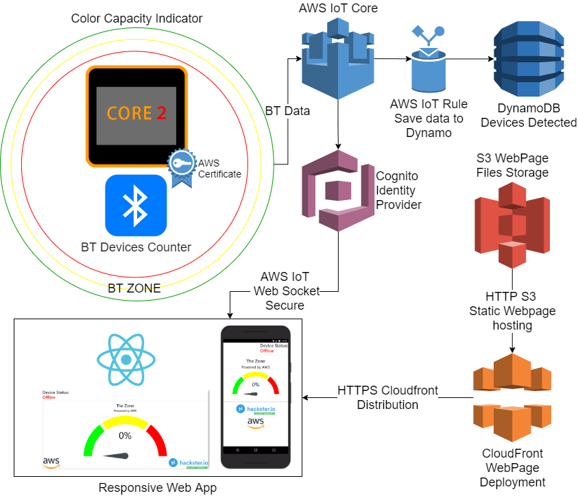

# The-Zone

# Table of Contents:

- [The-Zone](#the-zone)
- [Table of Contents:](#table-of-contents)
- [Introduction:](#introduction)
- [Solution:](#solution)
- [Materials:](#materials)
- [Connection Diagram:](#connection-diagram)
- [M5 Core2 AWS Setup:](#m5-core2-aws-setup)
- [AWS Services:](#aws-services)
  - [AWS IoT:](#aws-iot)
  - [AWS DynamoDB:](#aws-dynamodb)
  - [AWS IoT Rule:](#aws-iot-rule)
  - [AWS IoT Web Socket Secure:](#aws-iot-web-socket-secure)
    - [IoT Credentials:](#iot-credentials)
    - [Cognito Credentials:](#cognito-credentials)
    - [ReactJS IoT Component:](#reactjs-iot-component)
  - [AWS S3:](#aws-s3)
  - [AWS CloudFront:](#aws-cloudfront)
- [Final Product:](#final-product)
- [WebPage:](#webpage)
- [EPIC DEMO:](#epic-demo)

# Introduction:

Help Maintain establishments with the maximum number of people recommended by law.

# Solution:

According to Statista, more than 85% of adults in the United States own a cell phone, thanks to that I develop a system based on the analysis of BT devices within establishments in order to carry out a census of the people who are in the establishment.

https://www.statista.com/statistics/219865/percentage-of-us-adults-who-own-a-smartphone/

Differences with existing technologies:

https://www.rs-online.com/designspark/people-counter-project-for-covid-19

https://www.footfallcam.com/Industries/Covid-19-Automated-Occupancy-Control-System

Current systems use sensors, video cameras and high infrastructure costs to install this type of device to count people.

Our solution offers a plug and play solution that will easily allow the counting of people without large infrastructures with a simple deployment in a web app and notifications.

WebPage: https://d3vv2w0ip0ot9g.cloudfront.net/

# Materials:

Hardware:

1. M5Stack Core2 ESP32 IoT Development Kit for AWS IoT EduKit - [Product Link](https://shop.m5stack.com/collections/stack-series/products/m5stack-core2-esp32-iot-development-kit-for-aws-iot-edukit)

Software:

1. Arduino IDE - [Program Link](https://www.arduino.cc/en/software)
2. Arduino M5Core2 Library - [Library Link](https://github.com/m5stack/M5Core2)

Cloud Services:

1. IoT Core - [Service Link](https://aws.amazon.com/iot-core/)
2. DynamoDb - [Service Link](https://aws.amazon.com/dynamodb/?nc2=type_a)
3. Cognito - [Service Link](https://aws.amazon.com/cognito/)
4. S3 - [Service Link](https://aws.amazon.com/s3/?nc2=type_a)
5. CloudFront - [Service Link](https://aws.amazon.com/cloudfront/?nc2=type_a)

# Connection Diagram:

# M5 Core2 AWS Setup:

Primero que nada debes saber que para desarollar en el M5Core2 tenemos 4 opciones ecepcionales para ello, [FreeRTOS](https://aws.amazon.com/freertos/), [MicroPython](http://micropython.org/), [UIFlow](https://flow.m5stack.com/), [Arduino](https://www.arduino.cc/) development frameworks.

* Arduino Library for M5Core2 [Library Link](https://github.com/m5stack/M5Core2)
* Arduino ESP32 Support [Repository Link](https://github.com/espressif/arduino-esp32)

Para este desarrollo se prefirio Arduino IDE debido a la expreiencia de utilizar el ESP32 antes en proyectos de IoT, ya que todos los codigos utilizados para el ESP32 funcionan correctamente en esta board. En la carpeta Arduino Test, dejaremos un codigo sencillo para que puedas familiarizarte con la programacion del M5Core2 en el Arduino IDE.

[Test Code](https://github.com/altaga/The-Zone/tree/main/Arduino%20Test/M5StackTestRTCwWiFiSyncNTP)

Si puedes ver lo siguiente en la pantalla, estamos listos para pasar a programar el codigo principal.

El [Main Code](https://github.com/altaga/The-Zone/tree/main/Arduino%20Code/TheZone) tiene las siguientes partes importantes.

# AWS Services:

## AWS IoT:

## AWS DynamoDB:

## AWS IoT Rule:

## AWS IoT Web Socket Secure:

### IoT Credentials:

### Cognito Credentials:

### ReactJS IoT Component:

## AWS S3:

## AWS CloudFront:

# Final Product:

# WebPage:

# EPIC DEMO: